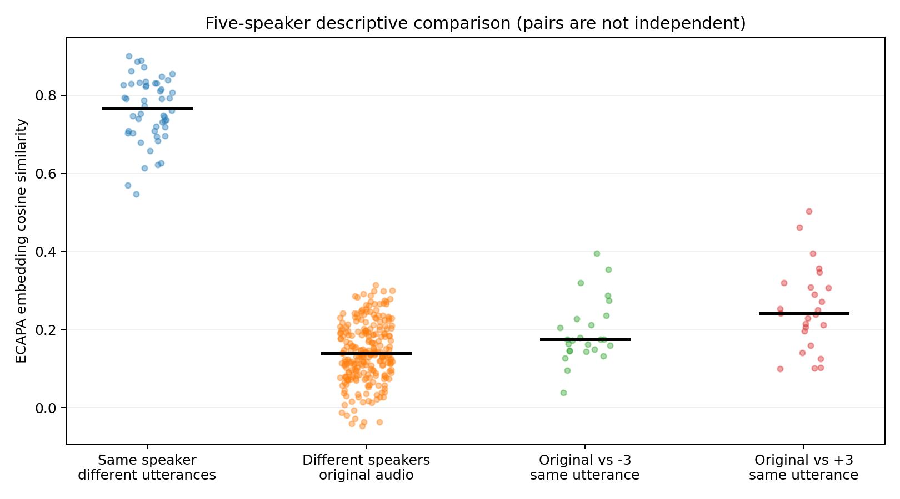

# Pitch shifting, transcription errors, and speaker representations

An exploratory English speech evaluation · 19 September 2026

## Main finding

On 25 English utterances from five speakers, pitch shifts of +3 and -3 semitones
increased corpus word error rate (WER) from 1.62% to 14.80% and 23.65%, respectively.
They also reduced original-to-transformed ECAPA embedding similarity well below
the same-speaker/different-utterance reference scores in this sample. These
observations show a cost to transcription quality alongside representation
change; they do not establish protection against speaker identification.

This project was developed as a small preparatory study for research on speech
privacy and utility. Its contribution is a working evaluation pipeline and an
auditable analysis of its results, rather than a new anonymization method.

## Research question and scope

How does a simple pitch transformation affect automatic transcription and a
pretrained speaker representation? Does the effect vary across speakers, and
what do text errors and exploratory listening add to aggregate scores?

Pitch shifting provides a controlled perturbation. It is not evaluated here as
a deployable anonymization system. Speech content de-identification, clinical
biomarkers, medical semantics, and multimodal understanding are outside this run.

## Data and procedure

The main experiment uses `openslr/librispeech_asr`, configuration `clean`, split
`validation`: English audiobook readings, not conversation or clinical speech.
The first five encountered speakers were selected, with their first five
utterances each. Speaker IDs are 2277, 2035, 2086, 7976, and 1988. This convenience
sample is neither randomized nor demographically balanced. Exact utterance IDs
are retained in the [sample manifest](outputs/english_5speakers/sample_manifest.csv).

Each utterance was evaluated unchanged and after librosa pitch shifts of -3 and
+3 semitones, giving 75 condition records. The shift size was an exploratory
choice, not tuned to maximize performance. Audio was decoded with SoundFile and
processed at 16 kHz. Whisper `openai/whisper-base.en` provided transcriptions;
`speechbrain/spkrec-ecapa-voxceleb` provided speaker embeddings. Runs used CPU
PyTorch 2.14.0 on Windows. No model training or fine-tuning was performed.

An earlier 12-utterance pilot used `hf-internal-testing/librispeech_asr_dummy`.
Inspection showed that its locally cached 73 utterances contained only speaker
1272. The main experiment therefore changed datasets rather than simply raising
the sample count. The pilot remains available but is not pooled into the main run.

## Metrics and scoring correction

WER uses substitutions (S), deletions (D), and insertions (I) against reference
words (N). Two aggregations are retained:

- **Utterance mean:** mean of each utterance's `(S + D + I) / N`.
- **Corpus WER:** sum of errors across separately aligned utterances, divided by
  the sum of reference word counts. Utterances are not concatenated for alignment.

The original text rule uppercases English text and removes punctuation except
apostrophes. Pilot inspection found that `MR` versus `MISTER` was being counted
as a substitution. The added rule `english_mr_mister_v1` maps the exact token
`MR` (including `Mr.` after punctuation processing) to `MISTER` in both references
and hypotheses. Ambiguous abbreviations such as `DR` and `ST`, names, and other
spelling variants are not merged.

This is a post-hoc scoring correction, not a preregistered rule. Original scores
and texts are preserved alongside the revised scores. Pilot mean WER fell from
9.69% to 7.06% for original audio, 22.49% to 19.86% for +3, and 43.50% to 41.71%
for -3. The correction did not change main-experiment WER.

Speaker similarity is cosine similarity of ECAPA embeddings. It is a descriptive
representation measure, not a calibrated identity probability or privacy score.

## Transcription results

All conditions contain the same 25 utterances and 554 reference words.

| Condition | S | D | I | Corpus WER | Utterance mean WER |
| --- | ---: | ---: | ---: | ---: | ---: |
| Original | 8 | 0 | 1 | 1.62% | 2.07% |
| +3 semitones | 62 | 11 | 9 | 14.80% | 15.21% |
| -3 semitones | 100 | 17 | 14 | 23.65% | 24.43% |

Source: [corpus summary](outputs/english_5speakers/corpus_summary.csv).
The condition ordering is unchanged by aggregation choice. Substitutions account
for most errors, but this edit classification alone does not identify the acoustic cause.

| Speaker | Original mean WER | +3 mean WER | -3 mean WER |
| --- | ---: | ---: | ---: |
| 1988 | 4.51% | 13.04% | 17.24% |
| 2035 | 3.08% | 23.40% | 21.75% |
| 2086 | 0.78% | 13.57% | 26.89% |
| 2277 | 0.00% | 13.29% | 42.85% |
| 7976 | 2.00% | 12.75% | 13.43% |

Both shifts increased mean WER for all five speakers. Downward shifting was worse
for four speakers, while speaker 2035 showed the opposite ordering. With five
utterances each, these are descriptive differences, not population estimates.

## Speaker-similarity reference groups

Embeddings were recomputed from all saved WAVs using the local ECAPA model.
All unordered original-audio pairs were formed, excluding self-pairs: 50
same-speaker/different-utterance pairs and 250 different-speaker pairs. Each
original was also paired with its own transformed version for each direction.

| Comparison | Pairs | Mean | Median | Observed range |
| --- | ---: | ---: | ---: | ---: |
| Same speaker, different utterances | 50 | 0.762 | 0.767 | 0.548–0.901 |
| Different speakers, original audio | 250 | 0.143 | 0.139 | -0.046–0.315 |
| Original versus -3, same utterance | 25 | 0.194 | 0.175 | 0.039–0.396 |
| Original versus +3, same utterance | 25 | 0.253 | 0.241 | 0.100–0.503 |



Black bars mark medians. Horizontal jitter is only for visibility. The transformed
scores are below the observed same-speaker reference range and overlap part of
the different-speaker range. This gives context to the low transformed scores,
but is not evidence that an adapted attacker cannot recover identity.

Pairs share utterances and speakers, so their counts do not represent independent
observations. Original-to-original controls also differ in linguistic content,
whereas original-to-transformed pairs share the same source utterance. No threshold,
EER, confidence interval, or significance test is inferred from these distributions.
Recomputed saved-WAV scores differed from the earlier in-memory scores by at most
0.000685; the [comparison table](outputs/english_5speakers/speaker_similarity_recheck.csv)
retains both rather than silently replacing the originals.

## Error cases and listening observations

Cases were selected after the run using an explicit rule: largest normalized WER
increase in each shift direction, and smallest maximum absolute change across
both directions. Ties use utterance ID order. Extreme cases are illustrative and
can favor short utterances; the [full ranking](outputs/english_5speakers/case_ranking.csv)
is retained. The [case report](outputs/english_5speakers/error_analysis.md) provides
full transcripts, edit alignments, and audio links.

| Case | ASR observation | Listener observation |
| --- | --- | --- |
| `2277-149896-0004`: largest -3 increase | Original 0%; -3 71.43%; +3 14.29%. Both shifts changed WOULD to DID. | WOULD was clearer in the original; transformed versions remained understandable with the reference text. |
| `1988-147956-0004`: largest +3 increase | Original 0%; +3 40.91%. AGAINST itself remained correct. | Upward shift was harder to understand, with muddiness starting around AGAINST. |
| `2277-149896-0001`: least change | Original and +3 0%; -3 3.85%, one DID-to-WOULD substitution. | Speech after PAY HER THE MONEY sounded unclear; downward shift required more effort, but understanding was possible after hearing the original. |

The first case has only seven reference words: five substitutions yield 71.43%
WER. It should not be presented as typical performance. In the second case,
subjective difficulty and model errors did not coincide word for word. In the
third, low WER coexisted with reported listening effort.

Feedback came from one listener with reference-text or original-audio cues, not
a controlled blinded test. It suggests useful questions about clarity and effort,
but supplies no human transcription accuracy or clinical-utility measurement.
The [listening notes](outputs/english_5speakers/listening_notes.md) retain the
feedback and exposure conditions separately from automatically generated reports.

## Interpretation and limits

Within this sample, simple pitch shifts changed speaker embeddings while also
damaging ASR output. The worse aggregate result for downward shifting was not
universal across speakers. Text scoring conventions affected the pilot, showing
why inspecting errors matters before interpreting aggregate WER. Exploratory
listening also exposed difficulties that low WER did not necessarily capture.

These findings are limited to English audiobook readings, two shift settings,
one ASR model, one speaker model, and a small convenience sample. They do not
establish a privacy–utility optimum. No speaker-verification attack with separate
enrollment and test material, adaptive attacker, content de-identification,
clinical task, or multilingual evaluation was conducted. In particular, retaining
words does not demonstrate preservation of paralinguistic clinical information.

The experiment log was reconstructed from the working session and saved files,
not maintained as a preregistered protocol. Complete historical dependency
snapshots and all model/dataset revisions were not captured. Scripts and selected
IDs are provided, but exact numerical reproduction is not guaranteed.

## Reproduction and artifacts

Install the dependencies as described in [README](README.md), then run:

```powershell
python run_experiment.py --n-speakers 5 --per-speaker 5 --pitch-steps -3 3 --device cpu --save-audio 25 --output-dir outputs/english_5speakers
python rescore_results.py outputs/results.csv outputs/english_5speakers/results.csv
python analyze_results.py outputs/english_5speakers/results.csv
python compare_speakers.py outputs/english_5speakers
```

The `outputs/results.csv` argument rescoring the pilot assumes that file already
exists; omit it for a fresh main-experiment-only run. The first command downloads
data/models as needed; the remaining analysis uses saved outputs, and the speaker
comparison requires the downloaded local model files. Reusing the same output
directory overwrites those outputs: choose a new directory for future runs and
pass that directory to subsequent analysis commands.

Windows issues encountered included TorchCodec decoding and SpeechBrain symlink
permissions. The implemented solutions use SoundFile decoding and model-file
copying. Details, checks, and scoring revisions are recorded in the
[experiment log](EXPERIMENT_LOG.md).

## Next work

Before expanding scope, capture a versioned run configuration, environment and
model/data revisions. A stronger privacy study would add a defined enrollment/test
protocol and attackers appropriate to the transformation. A larger, independently
sampled speaker set and controlled listening task would support more general
claims. Clinical or multilingual work would require task-specific data, text
normalization, models, and utility measures rather than extrapolation from this run.
